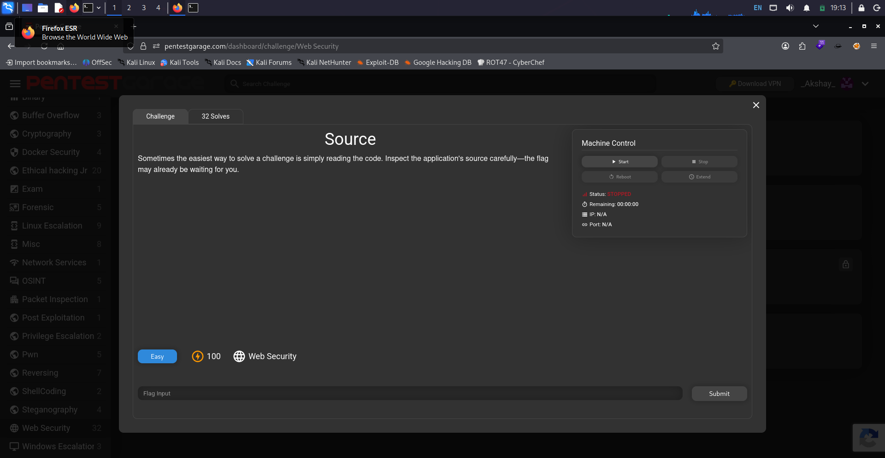
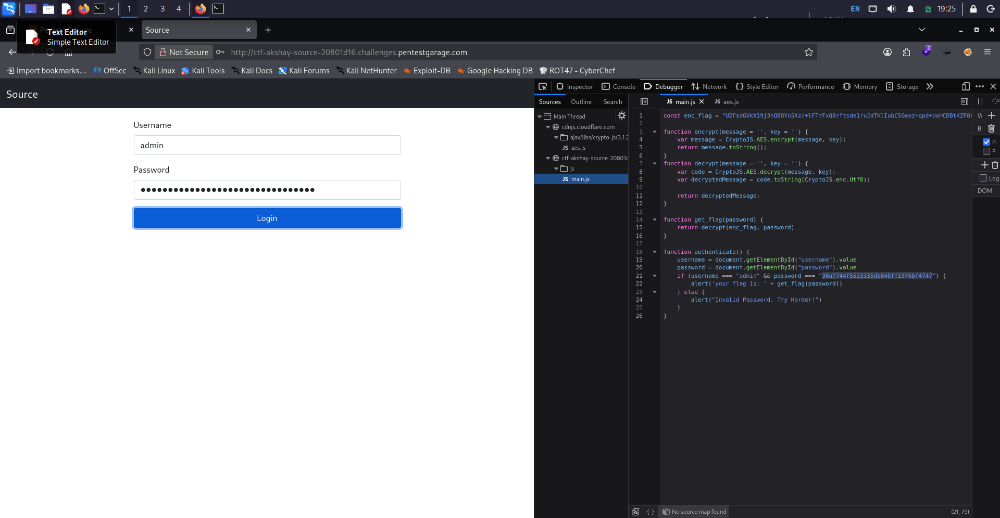
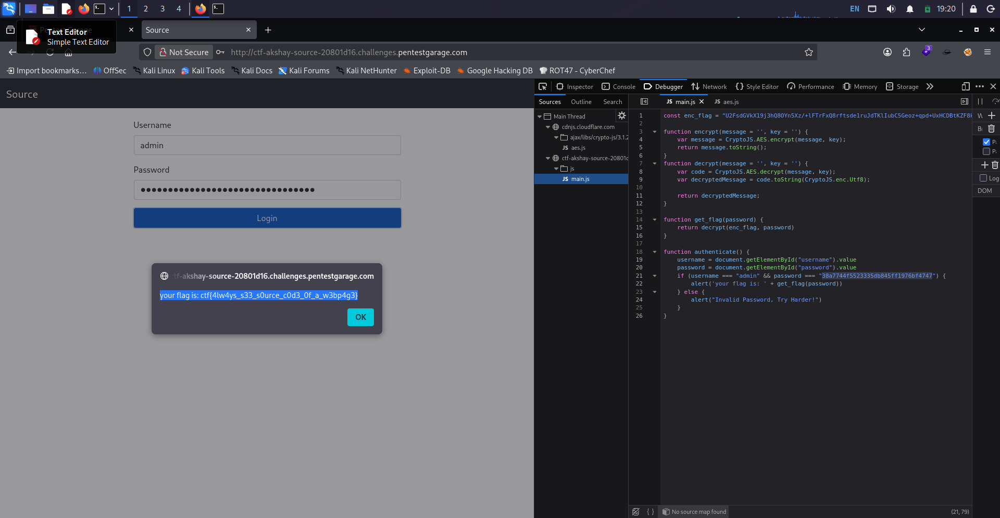

# Source

> **Red Team Academy / Pentest Garage — Web Exploitation**

## 📌 Challenge Information

| Field          | Details                                                   |
| -------------- | --------------------------------------------------------- |
| **Challenge**  | Source                                                    |
| **Category**   | Web Exploitation                                          |
| **Difficulty** | Easy                                                      |
| **Target**     | `ctf-akshay-source-20801d16.challenges.pentestgarage.com` |
| **Port**       | `80`                                                      |
| **Technique**  | Source Code Analysis / Hardcoded Credentials              |

---

## 🎯 Challenge Overview

The challenge provided a web application running on port `80`.

The challenge description suggested that the solution could be found by carefully inspecting the application's source code rather than immediately performing active enumeration or exploitation.

Based on this hint, the initial approach focused on examining the client-side JavaScript.

---

## 🔎 Source Code Inspection

I opened the web application and inspected its source using the browser's Developer Tools.

Under the **Debugger / Sources** section, the application's `main.js` file was identified.


The JavaScript contained an encrypted flag:

```javascript
const enc_flag =
"U2FsdGVkX19j3hQ8OYn5Xz/+lFTrFxQ8rftsde1ruJdTKlIubC5Geoz+qpd+UxHCDBtKZF8kI9eb3nwV4UIwNA=="
```

The source also contained functions responsible for decrypting this value:

```javascript
function decrypt(message = '', key = '') {
    var code = CryptoJS.AES.decrypt(message, key);
    var decryptedMessage = code.toString(CryptoJS.enc.Utf8);
    return decryptedMessage;
}

function get_flag(password) {
    return decrypt(enc_flag, password);
}
```

This revealed that the encrypted flag could be decrypted using a password supplied to `get_flag()`.

---

## 🔐 Discovery of Hardcoded Credentials

Further inspection of `main.js` revealed the application's authentication logic:

```javascript
function authenticate() {
    username = document.getElementById("username").value
    password = document.getElementById("password").value

    if (username === "admin" &&
        password === "38a7744f5523335db845ff1976bf4747") {

        alert('your flag is: ' + get_flag(password))

    } else {
        alert("Invalid Password, Try Harder!")
    }
}
```



The application therefore exposed valid administrator credentials directly within client-side JavaScript.

### Discovered Credentials

```text
Username: admin
Password: 38a7744f5523335db845ff1976bf4747
```

An important observation was that the same password was also passed to `get_flag()`, meaning the discovered password was used as the decryption key for the encrypted flag.

---

## 🔑 Authentication

The discovered credentials were entered into the application's login form:

```text
Username: admin
Password: 38a7744f5523335db845ff1976bf4747
```


The authentication condition was satisfied and the following JavaScript was executed:

```javascript
alert('your flag is: ' + get_flag(password))
```

The application successfully decrypted and displayed the flag.

---

## 🚩 Flag



```text
ctf{4lw4ys_s33_s0urce_c0d3_0f_a_w3bp4g3}
```

---

## 🧠 Vulnerability Analysis

The primary weakness was the exposure of sensitive authentication logic and credentials within client-side JavaScript.

Because JavaScript is delivered to the browser, an attacker can inspect the source code and identify information that the developer may have intended to keep hidden.

In this challenge, the following sensitive information was exposed:

* Administrator username
* Administrator password
* Authentication logic
* Encrypted flag
* Logic used to decrypt the flag

This made it possible to bypass the intended authentication process simply by inspecting the application's source code.

---

## 💥 Impact

Exposing authentication credentials and security-sensitive logic in client-side code can allow an attacker to:

* Discover valid credentials
* Understand authentication logic
* Bypass intended security controls
* Access protected functionality
* Recover sensitive information

Client-side code should therefore never be treated as a trusted security boundary.

---

## 🛡️ Remediation

A secure implementation should:

* Perform authentication on the server side.
* Never hardcode credentials in client-side JavaScript.
* Never expose passwords or authentication secrets to the browser.
* Keep encryption keys and other secrets on the server.
* Perform authorization checks server-side.
* Use secure password hashing and verification mechanisms.
* Avoid placing sensitive challenge/application data directly in frontend code.

---

## 🛠️ Tools Used

* Web Browser
* Browser Developer Tools
* JavaScript Source Analysis
* CryptoJS
* Kali Linux

---

## 📚 Key Takeaways

This challenge demonstrated the importance of **source code analysis during web application penetration testing**.

The challenge did not require complicated exploitation. Simply examining the application's JavaScript revealed the authentication credentials and the mechanism used to decrypt the flag.

### Main lesson

> **Never assume that information hidden inside client-side JavaScript is actually secret.**

Anything delivered to the browser should be considered accessible to the user.
